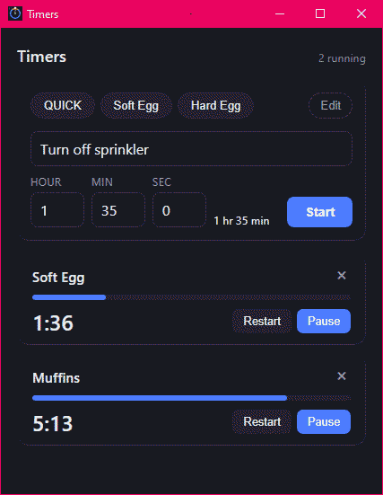

# timers

[](https://github.com/AndrewWPhillips/timers-wails/actions/workflows/ci.yml)
[](go.mod)
[](https://github.com/AndrewWPhillips/timers-wails/commits/main)
[](LICENSE)
[](https://v3.wails.io)
[](#development)

I wrote this countdown timer to see how easy it is to do in Go and because
I have never been happy with the Windows timer, nor any timer app I have tried
on Linux or Android.

(Many years ago I started a timers app using the Go "Fyne" package - see 
https://github.com/AndrewWPhillips/timers.  This new version instead uses
"Wails" version 3 which works really well.)

## Features

Specifically, the features I have always wanted is to be able to:
* simply and quickly start a new timer
* have any number of timers running simultaneously
* configure any number of named presets
* have timers resume after program/OS restart
* make it obvious when a timer has finished
* but alarms must NEVER interrupt, (no "bring to front")



## Development

Claude created this app using Go + [Wails v3](https://v3.wails.io) with a Vue 3 / TypeScript frontend.

Of course, I have inspected Claude's code, tested and tweaked it.  Note that it has
only currently been tested on Windows, but I'll try Linux, Mac and maybe Android soon.

(One nice thing Cluade thought to add was a built-in alarm sound that can be overridden
by selecting a sound file.)

### Windows version

I did a bit of work to make the alarm work the way I want on Windows.  It flashes the
window and the taskbar button whether, or not, the window is focused.  I used the cool
ability of Wails to directly manipulate native windows (HWND) - see flash_windows.go.

## Running

```bash
wails3 task dev
```

Build a release binary into `bin/`:

```bash
wails3 task build
```

There is also a headless server build, handy for testing the backend in a
browser without a native window:

```bash
wails3 task run:server
```

## Design

Here are some notes from Claude...

**Deadlines, not countdowns.** A running timer stores an absolute deadline;
remaining time is always derived from it, never decremented on a tick. Dropped
frames, a throttled webview, machine sleep and full restarts therefore need no
special handling — whatever the gap, the arithmetic still comes out right.

**Go owns the truth, the frontend owns the smoothness.** Go holds authoritative
state and decides expiry. The frontend renders countdowns locally from each
deadline, so there is no per-timer, per-tick traffic across the bridge: one
shared 10Hz clock drives every card, and N timers cost one reactive dependency
rather than N loops. Go emits only discrete events — a timer expiring, or a
batch of them expiring together after the machine wakes.

**Expiry is one reconciliation pass**, not a `time.AfterFunc` per timer. Every
200ms the engine expires whatever is overdue. A machine that slept through six
deadlines expires all six on the next tick, and a timer whose deadline passed
while the app was closed expires during the restore.

**State is written on each transition**, not on a schedule. A running timer's
stored deadline never changes, so there is nothing to save between transitions —
and a hard kill still leaves the file correct. Writes go via a temp file and a
rename, so an interrupted save cannot truncate the settings.

Settings live in `%AppData%\timers\timers.json` (or the platform equivalent of
`os.UserConfigDir()`).

## Layout

```
main.go              app and window wiring, event registration
timerservice.go      the Wails-bound service — a thin adapter over the engine
alarm.go             serves a user-chosen alarm sound to the webview
internal/timer/      the countdown engine: state machine, expiry, restore
internal/settings/   presets, alarm settings, atomic JSON persistence
frontend/src/        Vue 3 + TypeScript UI
```

The engine and the settings store have no Wails dependency, so both are unit
tested directly:

```bash
go test ./...
```

Note that `go build ./...` fails on `build/ios`, which is Wails template
scaffolding for iOS packaging: a `package main` with no `main` function that is
only meant to be compiled as part of an iOS build. `wails3 task build` and
`go test ./...` are unaffected.
